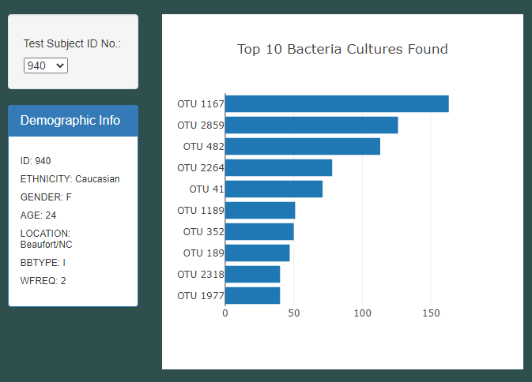
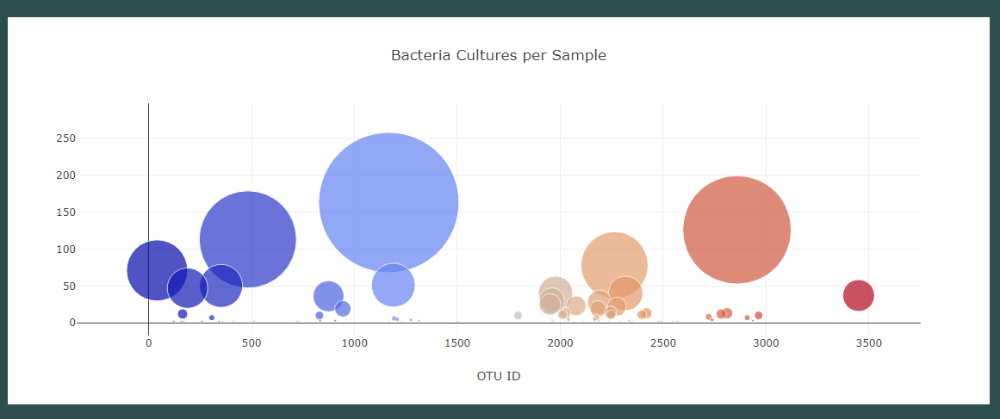
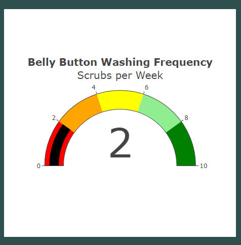

# Bellybutton_Biodiversity

## Project Overview
The goal of this analysis is to help track the bacterial constitution of various subject participants. Participants agreed to have their belly buttons sampled with a swab in order to identify which bacterial strains are present in one's navel, and the amount of each bacterial strain present. We have partnered with the lab running these tests: Improbable Beef, as they search for bacterial species that can synthesize proteins to produce flavor profiles that mimic the flavors of beef. The makeup of each particpant's belly button fauna will be important to note and follow, as these bacterial species will be tested to synthesize proteins that taste like beef. Labs across the US have had success in synthesizing meat flavors from algae, fungi, and microorganisms found on plant roots - However, Improbable Beef is still searching for the elusive bacteria that will provide the perfect beef taste.

The human body is a source of thousands of types of bacteria. Different parts of the body harbor different species. Furthermore, each human body can produce varied environments, full of a vast array of different bacterial presences. We hypothesize that the ideal bacteria to synthesize proteins to create the best beefy flavor lie in belly buttons - at least *someone's* belly button, given the diverse spread of bacteria present in the average belly button.

So, to test this hypothesis, Improbable Beef labs have gathered samples from individuals all across the country to document various bacterial species that colonize our belly buttons.

## Resources
- Data sources: samples.json
- Software: Visual Studio Code 1.60.2, JavaScript 1.7, D3.js, HTML 5, CSS 3, Bootstrap

## Results
We have created a dashboard that both our research participants and fellow researchers can access. Those who participated in the study can visit a website and select their ID number (assigned to each participant) to see which bacterial species live in their navels.

Below, you can see a snapshot of the page. The research participant is able to find and select the ID assigned to them at the conclusion of the swabbing procedure. Now, they can see a bar chart displaying the top 10 most abundant bacterial strains from their belly buttons.

Additionally, my webpage provides a bubble graph which depicts the variety and relative proportions of bacterial species' presences in one's belly button. The larger the bubble, the greater the amount of that bacterial species in the sample. Additionally, when a user hovers over a bubble, they are presented with the name of the bacterial strain, the OTU ID of the strain, and the amount of bacteria of that strain present in the sample. The colorscale of the various bubble points helps the viewer visualize the sheer amount of variety in micro fauna from their belly button. 

Finally, I included a gauge that appears on the webpage as well, depicting the washing frequency of the participant's belly button per week. Having this gauge next to the other two charts helps us see patterns from participant to participant. 

## Summary
A recurring pattern we can induce from this visual data is that micro fauna flourish more so in belly buttons washed less frequently. They flourish in terms of both variety of bacterial strains as well as sheer amount of bacteria present. Those with more bacteria present may offer a greater well of potential for finding that *perfect* strain of bacteria to synthesize proteins that produces a flavor profile closest to genuine beef.